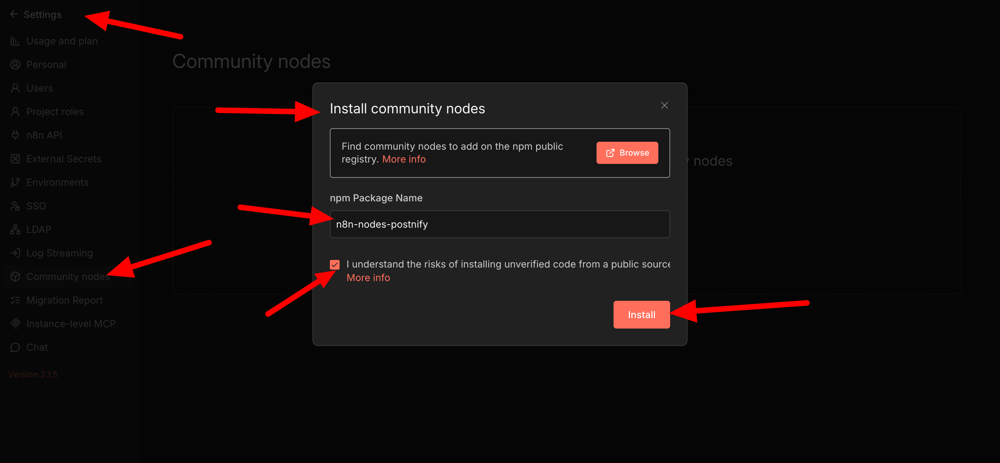

# n8n-nodes-postnify

[Postnify](https://postnify.com) is a powerful social media scheduling tool that allows you to manage your social media accounts efficiently.

Use n8n to automate your workflow and post to multiple social media platforms at once.

For example: Load news from Reddit >> Make it a video with AI >> Post it to your social media accounts.

Postnify supports: X, LinkedIn, BlueSky, Instagram, Facebook, TikTok, YouTube, Pinterest, Dribbble, Telegram, Discord, Slack, Threads, Lemmy, Reddit, Mastodon, Warpcast, Nostr and VK.

---

> **Note**
> If your Postnify instance uses a reverse proxy on port 5000,
> your host must end with `/api`, for example:
> `http://yourdomain.com/api`

Check the [Postnify API documentation](https://docs.postnify.com/public-api) for more information.

---

## Installation (quick)

- Click on **Settings**
- Click on **Community Nodes**
- Click on **Install**
- Enter `n8n-nodes-postnify` in the **npm Package Name** field
- Click on **Install**



---

## Installation (manual — non-docker)

Go to your n8n installation directory (usually `~/.n8n`). Create the `custom` folder if it doesn't exist:

```bash
mkdir -p ~/.n8n/custom
cd ~/.n8n/custom
npm init -y
npm install n8n-nodes-postnify
```

---

## Installation (manual — docker)

```bash
docker exec -it <n8n-container> /bin/sh
cd /home/node
npm install n8n-nodes-postnify
```

Then restart the container.

---

## Credentials

1. In n8n, go to **Credentials** → **New**
2. Search for **Postnify API**
3. Enter your **API Key** (found in Postnify → Settings → Developers → Access)
4. Enter your **Host** (default: `https://api.postnify.com`, or your self-hosted URL ending in `/api`)

---

## Operations

| Operation | Description |
|-----------|-------------|
| **Create Post** | Schedule a post to one or more channels |
| **Get Posts** | List posts within a date range |
| **Delete Post** | Delete a post by ID |
| **Get Channels** | List all connected social media channels |
| **Upload File** | Upload a file and get back a URL |
| **Generate Video** | Generate AI videos |
| **Video Function** | Execute video-related functions (e.g. load voices) |

---

## Links

- **Website:** [postnify.com](https://postnify.com)
- **API Docs:** [docs.postnify.com/public-api](https://docs.postnify.com/public-api)
- **GitHub:** [postnifyhq/postnify-n8n](https://github.com/postnifyhq/postnify-n8n)
- **Issues:** [Report bugs](https://github.com/postnifyhq/postnify-n8n/issues)

---

## License

MIT
